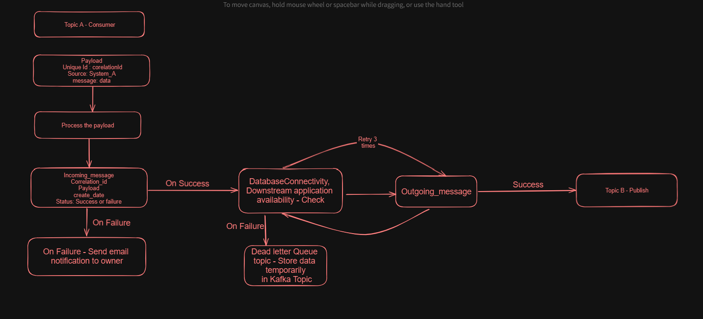

## Learning Journey

I am currently on a learning journey, and a significant part of my education is derived from an Udemy Course -- **Apache Kafka Series - Learn Apache Kafka for Beginners v3**, and it has been a valuable resource in expanding my knowledge in Apache Kafka. I highly recommend checking it out if you're interested in the same.

Feel free to explore the <a href="https://www.udemy.com/course/apache-kafka/?utm_source=adwords&utm_medium=udemyads&utm_campaign=DSA_Catchall_la.EN_cc.INDIA&utm_content=deal4584&utm_term=_._ag_82569850245_._ad_533220805574_._kw__._de_c_._dm__._pl__._ti_aud-2268488108799%3Adsa-437115340933_._li_1007809_._pd__._&matchtype=&gad_source=1&gclid=CjwKCAiA2pyuBhBKEiwApLaIO2YJDJjGbCvAZQNVV_lgOFPQ0G3qy2oNqGb92AxhXO7Y_SpPtjzr3hoCzaAQAvD_BwE)https://www.udemy.com/course/apache-kafka/?utm_source=adwords&utm_medium=udemyads&utm_campaign=DSA_Catchall_la.EN_cc.INDIA&utm_content=deal4584&utm_term=_._ag_82569850245_._ad_533220805574_._kw__._de_c_._dm__._pl__._ti_aud-2268488108799%3Adsa-437115340933_._li_1007809_._pd__._&matchtype=&gad_source=1&gclid=CjwKCAiA2pyuBhBKEiwApLaIO2YJDJjGbCvAZQNVV_lgOFPQ0G3qy2oNqGb92AxhXO7Y_SpPtjzr3hoCzaAQAvD_BwE">course</a>

-----------------------------------------------------------------------------
<a href="https://www.conduktor.io/kafka/how-to-install-apache-kafka-on-windows-without-zookeeper-kraft-mode">Steps</a> to install Kafka in Windows WSL2.
-----------------------------------------------------------------------------
## Start Kafka on local machine via CLI after installation: 
    1. ~/kafka_2.13-3.6.1/bin/kafka-storage.sh random-uuid
    2. ~/kafka_2.13-3.6.1/bin/kafka-storage.sh format -t <uuid> -c ~/kafka_2.13-3.6.1/config/kraft/server.properties
    3. ~/kafka_2.13-3.6.1/bin/kafka-server-start.sh ~/kafka_2.13-3.6.1/config/kraft/server.properties
    
**Note:** 
1. From Kafka 3.3.1, Zookeeper is not required anymore and Kafka can be started with Kraft.
2. Everytime after system restart, disable ipv6 in WSL2 Ubuntu using below commands, else below error will occur.
 #
     ERROR: org.apache.kafka.clients.NetworkClient Error connecting to node broker:29092 (id: -1 rack: null) java.net.UnknownHostException: broker: Name or service not known
     sudo sysctl -w net.ipv6.conf.all.disable_ipv6=1
     sudo sysctl -w net.ipv6.conf.default.disable_ipv6=1

------------------------------------------------------------------------------------------------------------------
## Kafka-Broker: 
1. Broker is nothing but as a server, acts as a message broker, handling the storage, retrieval, and 
   transportation of messages between producers and consumers within a Kafka cluster.
2. **Message Storage**: Kafka brokers store messages in topics, messages within a topic are further divided into partitions,
   allowing for parallel processing and scalability.
3. **Message Transportation:**
   Brokers are responsible for receiving messages from producers and delivering them to consumers.
4. **Data Replication:** Kafka supports data replication for fault tolerance and high availability.
------------------------------------------------------------------------------------------------------------------
## Producer:
1. Can have number of partitions and replication factor as desired
2. Send data to topic - without keys 
   1. Without keys - will be assigned to different partitions
   2. For data's send without key, the partition will be assigned based on **partitioner.class** property.
      Eg: RoundRobinPartitioner(self explained), StickyPartitioner (batch of records goes to single partition)
3. Send data to topic - with keys
   1. same key will always be assigned to same partition using Murmur2 algorithm or 
         using CustomPartitioner(user created logic)
   2. Note: But if partition is added to a topic, murmur2 algorithm produces different result.

### Kafka Producer Properties:
    acks=-1 or acks=all ==> Ensure data is persisted properly in leader and replicas, No data loss.
    min.insync.replicas=2 ==> Ensures two brokers in ISR at least have the data after an ack.
    enable.idempotence=true ==> Duplicates are not introduced due to network retries.
    reties=Integer.MAX_INT ==> retries until delivery.timeout.ms is reached. Default 2 mins.
    max.in.flight.requests.per.connection = 5 ==> Ensure maximum performance while keeping message ordering.
    
###  linger.ms and batch.size ==> properties:
    1. producer will wait till batch.size = (16 * 1024) is reached before sending them, default 16kb  
       batch.size is per partition
    2. linger.ms = 0 how long to wait until we send a batch. 
    3. If  max.in.flight.requests.per.connection = 5, 
       means 5 message batches are inflight, if requests are incoming, kafka will start batching based on
       linger.ms and batch.size, when exceed batch.size, automatically sends the data.
    
----------------------------------------------------------------------------------------------------
## Consumer: 
1. Consumers are assigned partitions based on RangeAssignor, CooperativeStickyAssignor, RoundRobinAssignor, etc,
   can be dynamically configured via **partition.assignment.strategy** property.
2. If No of Consumers is more than no of partitions then extra consumers will be inactive(unused).
 
        Eg-1:               | Partition 1 |                                 | Consumer 1 | 
                            | Partition 2 |                                 | Consumer 2 | 
            Producers -->   | Partition 3 | -->  Consumer Group-1     -->   | Consumer 3 | 
                            | Partition 4 |                                 | Consumer 4 | 
                            | Partition 5 |                                 | Consumer 5 | 
                                                                            | Consumer 6 | --> Inactive  
3. Can have number of consumer groups and consumers as desired.

       Eg-2:                | Partition 1 |                                 | Consumer 1 | 
                            | Partition 2 |                                 | Consumer 2 | 
            Producers -->   | Partition 3 | -->  Consumer Group-1     -->   | Consumer 3 | 
                  |         | Partition 4 |                                 | Consumer 4 | 
                  |         | Partition 5 |                                 | Consumer 5 | 
                  |
                  ---------------------------->  Consumer Group-2     -->   | Consumer 1 |  
-----------------------------------------------------------------------
    
## Kafka CLI commands:
1. kafka-topics.sh --bootstrap-server localhost:9092 --list
2. kafka-topics.sh --bootstrap-server localhost:9092 --topic topic_name --create --partitions 3 --replication-factor 1
3. kafka-topics.sh --bootstrap-server localhost:9092 --topic topic_name --describe
4. kafka-topics.sh --bootstrap-server localhost:9092 --topic topic_name --delete
5. kafka-console-consumer.sh --bootstrap-server localhost:9092 --topic topic_name --group g1 --from-beginning

-----------------------------------------------------------------------
Kafka Architecture Design :

